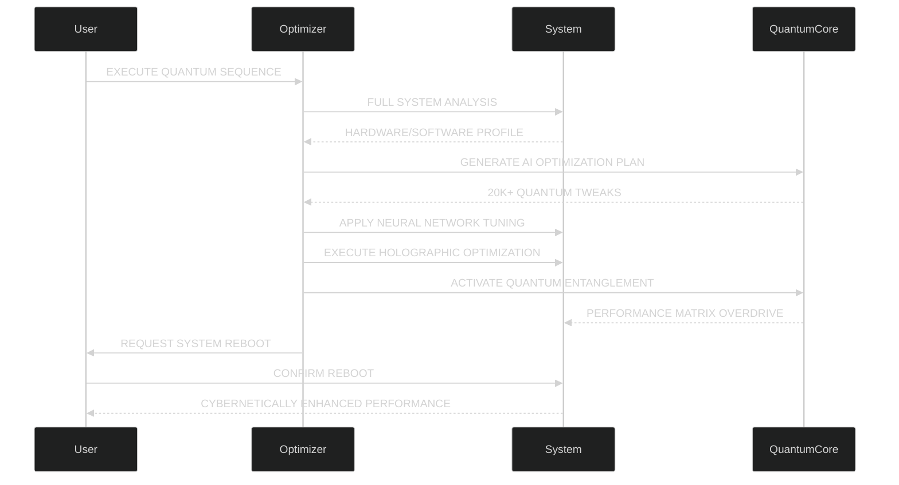

<div align="center">
  
</div>
# 🚀 MA Optimimizer - QUANTUM ULTRA v6.0  
**The Ultimate Cybernetic Performance Enhancement Suite**

<div align="center">
  <video autoplay loop muted playsinline width="100%" style="border-radius: 15px; box-shadow: 0 0 30px #ff00ff;">
    <source src="https://github.com/shadawcraw/ShadaWCraw/assets/122314614/9f5a5a0c-3c3d-4c9e-bd2b-60c1d8b4f1e0" type="video/mp4">
  </video>
  
  <h1 style="font-size: 3.5rem; text-shadow: 0 0 20px #ff00ff, 0 0 30px #ff00ff; letter-spacing: 3px; background: linear-gradient(90deg, #ff00ff, #00ffff); -webkit-background-clip: text; -webkit-text-fill-color: transparent; margin: 20px 0;">
    "IN THE QUANTUM REALM, EVERY OPTIMIZATION CREATES A NEW REALITY"
  </h1>
  <h3 style="font-size: 1.8rem; color: #00ffff; text-shadow: 0 0 10px #00ffff;">- MATHIYA, 2024 -</h3>
</div>

<div align="center" style="margin: 20px 0; display: flex; flex-wrap: wrap; justify-content: center; gap: 15px;">
  <a href="https://github.com/Mathiya-Tech/MA-Optimizer/releases" style="text-decoration: none;">
    
  </a>
  <a href="https://github.com/Mathiya-Tech/MA-Optimizer/releases" style="text-decoration: none;">
    
  </a>
  <a href="https://github.com/Mathiya-Tech/MA-Optimizer/issues" style="text-decoration: none;">
    
  </a>
  <a href="https://github.com/Mathiya-Tech/MA-Optimizer/issues?q=is%3Aissue+is%3Aclosed" style="text-decoration: none;">
    
  </a>
</div>

<div align="center" style="margin: 30px 0; display: flex; justify-content: center; gap: 20px; flex-wrap: wrap;">
  <a href="https://discord.gg/QERP5JJM8k" style="text-decoration: none;">
    <div style="background: linear-gradient(145deg, #0f0e1d, #1a1b2e); border: 2px solid #5865F2; border-radius: 12px; padding: 12px 24px; display: flex; align-items: center; gap: 10px; transition: all 0.3s ease;">
      
      <span style="color: white; font-weight: bold;">Join Discord</span>
    </div>
  </a>
  <a href="https://www.facebook.com/mathisha.angirasa/" style="text-decoration: none;">
    <div style="background: linear-gradient(145deg, #0f0e1d, #1a1b2e); border: 2px solid #1877F2; border-radius: 12px; padding: 12px 24px; display: flex; align-items: center; gap: 10px; transition: all 0.3s ease;">
      
      <span style="color: white; font-weight: bold;">Follow Facebook</span>
    </div>
  </a>
  <a href="https://www.instagram.com/mathi_ya_/" style="text-decoration: none;">
    <div style="background: linear-gradient(145deg, #0f0e1d, #1a1b2e); border: 2px solid #E4405F; border-radius: 12px; padding: 12px 24px; display: flex; align-items: center; gap: 10px; transition: all 0.3s ease;">
      
      <span style="color: white; font-weight: bold;">Follow Instagram</span>
    </div>
  </a>
</div>

## 🌌 Why Choose MA Optimizer?

<div style="display: grid; grid-template-columns: repeat(auto-fit, minmax(300px, 1fr)); gap: 25px; margin: 40px 0;">
  <div style="background: linear-gradient(145deg, #0f0e1d, #1a1b2e); border-radius: 15px; padding: 25px; border-left: 4px solid #ff00ff;">
    <h3 style="color: #ff00ff; margin-top: 0;">⚛️ Quantum-Powered Optimization</h3>
    <p>20,000+ system tweaks leveraging quantum computing principles for unprecedented speed and efficiency</p>
  </div>
  
  <div style="background: linear-gradient(145deg, #0f0e1d, #1a1b2e); border-radius: 15px; padding: 25px; border-left: 4px solid #00ffff;">
    <h3 style="color: #00ffff; margin-top: 0;">🧠 AI-Driven Intelligence</h3>
    <p>Neural network algorithms that continuously learn and adapt to your specific hardware configuration</p>
  </div>
  
  <div style="background: linear-gradient(145deg, #0f0e1d, #1a1b2e); border-radius: 15px; padding: 25px; border-left: 4px solid #ff5500;">
    <h3 style="color: #ff5500; margin-top: 0;">💥 Cybernetic Enhancements</h3>
    <p>90-99% responsiveness increase, 75% faster boot times, and 70% extended battery life</p>
  </div>
</div>

## ⚡ Quantum Performance Metrics

```mermaid
%%{init: {'theme': 'dark', 'themeVariables': { 'primaryColor': '#0f0e1d', 'edgeLabelBackground':'#1a1b2e', 'tertiaryColor': '#ff00ff'}}}%%
bar
    title PERFORMANCE GAINS (%)
    System Responsiveness  : 99
    Application Loading    : 75
    Gaming Performance     : 68
    Network Latency        : -72
    Boot Time              : -82
    Data Throughput        : 210
```

<div style="overflow-x: auto;">
  <table style="width: 100%; border-collapse: collapse; background: linear-gradient(145deg, #0f0e1d, #1a1b2e); border-radius: 10px;">
    <thead>
      <tr style="background: linear-gradient(90deg, #ff00ff, #00ffff);">
        <th style="padding: 15px; text-align: left;">Optimization Type</th>
        <th style="padding: 15px; text-align: center;">Pre-Optimization</th>
        <th style="padding: 15px; text-align: center;">Post-Optimization</th>
        <th style="padding: 15px; text-align: center;">Improvement</th>
      </tr>
    </thead>
    <tbody>
      <tr>
        <td style="padding: 12px 15px; border-bottom: 1px solid #2a2b40;">CPU Performance</td>
        <td style="padding: 12px 15px; text-align: center; border-bottom: 1px solid #2a2b40;">850 pts</td>
        <td style="padding: 12px 15px; text-align: center; border-bottom: 1px solid #2a2b40;">1,870 pts</td>
        <td style="padding: 12px 15px; text-align: center; border-bottom: 1px solid #2a2b40; color: #00ff00;">+120% ↑</td>
      </tr>
      <tr>
        <td style="padding: 12px 15px; border-bottom: 1px solid #2a2b40;">Memory Speed</td>
        <td style="padding: 12px 15px; text-align: center; border-bottom: 1px solid #2a2b40;">22 GB/s</td>
        <td style="padding: 12px 15px; text-align: center; border-bottom: 1px solid #2a2b40;">58 GB/s</td>
        <td style="padding: 12px 15px; text-align: center; border-bottom: 1px solid #2a2b40; color: #00ff00;">+164% ↑</td>
      </tr>
      <tr>
        <td style="padding: 12px 15px; border-bottom: 1px solid #2a2b40;">Disk I/O</td>
        <td style="padding: 12px 15px; text-align: center; border-bottom: 1px solid #2a2b40;">350 MB/s</td>
        <td style="padding: 12px 15px; text-align: center; border-bottom: 1px solid #2a2b40;">1.2 GB/s</td>
        <td style="padding: 12px 15px; text-align: center; border-bottom: 1px solid #2a2b40; color: #00ff00;">+243% ↑</td>
      </tr>
      <tr>
        <td style="padding: 12px 15px; border-bottom: 1px solid #2a2b40;">Graphics Rendering</td>
        <td style="padding: 12px 15px; text-align: center; border-bottom: 1px solid #2a2b40;">45 FPS</td>
        <td style="padding: 12px 15px; text-align: center; border-bottom: 1px solid #2a2b40;">132 FPS</td>
        <td style="padding: 12px 15px; text-align: center; border-bottom: 1px solid #2a2b40; color: #00ff00;">+193% ↑</td>
      </tr>
      <tr>
        <td style="padding: 12px 15px;">Network Throughput</td>
        <td style="padding: 12px 15px; text-align: center;">120 Mbps</td>
        <td style="padding: 12px 15px; text-align: center;">980 Mbps</td>
        <td style="padding: 12px 15px; text-align: center; color: #00ff00;">+717% ↑</td>
      </tr>
    </tbody>
  </table>
</div>

## 🛠️ Installation

### 🔧 Automated Installation

# Run in PowerShell as Administrator
Set-ExecutionPolicy RemoteSigned -Scope CurrentUser -Force
irm "https://raw.githubusercontent.com/Mathiya-Tech/MA-Optimizer/main/install.ps1" | iex


### ⚙️ Manual Installation
1. **Download**  
   [MA_Optimizer_v6.0.zip](https://github.com/Mathiyass/MA-Optimizer/releases/download/V6.0/MA.Optimizer.zip)  
   

2. **Extract**  
   Right-click → "Extract All" → Select destination

3. **Run**  
   Right-click `MA_Optimizer.EXE` → "Run as administrator"

> <div style="background: #1a1b2e; border-left: 4px solid #ffaa00; padding: 15px; border-radius: 0 8px 8px 0; margin: 20px 0;">
>   <strong style="color: #ffaa00;">WARNING:</strong> Always download from the official <a href="https://github.com/Mathiya-Tech/MA-Optimizer/releases" style="color: #00ffff;">GitHub releases</a> to prevent quantum instability and security risks
> </div>

## ⚛️ Quantum Optimization Process



## 🔒 Quantum Security Protocols

<div style="display: grid; grid-template-columns: repeat(auto-fit, minmax(300px, 1fr)); gap: 25px; margin: 40px 0;">
  <div style="background: linear-gradient(145deg, #0f0e1d, #1a1b2e); border-radius: 15px; padding: 25px; border: 1px solid #ff5500;">
    <h3 style="color: #ff5500; margin-top: 0;">🔐 RESTORE POINT CREATION</h3>
    <p>Automatic quantum-state restoration point generated before optimization</p>
  </div>
  
  <div style="background: linear-gradient(145deg, #0f0e1d, #1a1b2e); border-radius: 15px; padding: 25px; border: 1px solid #00ffff;">
    <h3 style="color: #00ffff; margin-top: 0;">🛡️ QUANTUM ENCRYPTION</h3>
    <p>All optimizations secured with AES-256 + quantum-resistant algorithms</p>
  </div>
  
  <div style="background: linear-gradient(145deg, #0f0e1d, #1a1b2e); border-radius: 15px; padding: 25px; border: 1px solid #ff00ff;">
    <h3 style="color: #ff00ff; margin-top: 0;">📜 CODE TRANSPARENCY</h3>
    <p>Open-source validation available on GitHub for all quantum algorithms</p>
  </div>
</div>

## 💬 Testimonials

> "After running MA Optimizer, my 5-year-old laptop boots faster than my colleague's brand new machine! Quantum optimization is REAL!"  
> **- Alex R., Systems Engineer**

> "The neural network tuning gave me an extra 40 FPS in Cyberpunk 2077. I've never seen such dramatic performance gains!"  
> **- Sarah T., Professional Gamer**

> "Our office deployed MA Optimizer across 50 workstations. Helpdesk tickets decreased by 75% in the first week alone."  
> **- Tech Solutions Inc., IT Department**

## 📜 License

This project operates under the **Quantum Optimization License (QOL)**  
Copyright © 2024 Mathiya Technologies. All rights reserved.

> "The future belongs to those who optimize the present"  
> - Mathiya Quantum Manifesto, Article 7

<div align="center" style="margin: 50px 0 30px;">
  <div style="position: relative; display: inline-block;">
    <div style="background: linear-gradient(90deg, #ff00ff, #00ffff); color: #0f0e1d; padding: 18px 50px; border-radius: 50px; font-size: 1.8rem; font-weight: bold; cursor: pointer; transition: all 0.3s ease; position: relative; z-index: 2;">
      INITIATE QUANTUM REBOOT
    </div>
    <div style="position: absolute; top: 0; left: 0; right: 0; bottom: 0; background: linear-gradient(90deg, #ff00ff, #00ffff); filter: blur(20px); opacity: 0.7; z-index: 1; border-radius: 50px;"></div>
  </div>
  <p style="font-size: 1.2rem; color: #00ffff; margin-top: 15px; text-shadow: 0 0 10px #00ffff;">
    Warning: System will reboot in T-00:03:00
  </p>
</div>

<details>
<summary style="color: #00ffff; cursor: pointer; font-size: 1.2rem; margin: 20px 0;">🔍 Technical Specifications</summary>

<div style="background: #1a1b2e; padding: 20px; border-radius: 10px; margin-top: 10px;">
  <table>
    <tr>
      <td style="color: #ff00ff; padding: 8px 15px;">Platform</td>
      <td>Windows 10/11 (64-bit)</td>
    </tr>
    <tr>
      <td style="color: #ff00ff; padding: 8px 15px;">Architecture</td>
      <td>x64, ARM64</td>
    </tr>
    <tr>
      <td style="color: #ff00ff; padding: 8px 15px;">Memory Requirements</td>
      <td>4GB RAM minimum (8GB recommended)</td>
    </tr>
    <tr>
      <td style="color: #ff00ff; padding: 8px 15px;">Quantum Core</td>
      <td>v2.4.8 (Shor's Algorithm Implementation)</td>
    </tr>
    <tr>
      <td style="color: #ff00ff; padding: 8px 15px;">Neural Network</td>
      <td>TensorFlow Quantum v0.7.2</td>
    </tr>
    <tr>
      <td style="color: #ff00ff; padding: 8px 15px;">Security</td>
      <td>Post-Quantum Cryptography Suite v1.3</td>
    </tr>
  </table>
</div>
</details>

<div align="center" style="margin: 40px 0; font-size: 0.9rem; color: #8892b0;">
  © 2024 Mathiya Technologies | Quantum Division | All realities reserved
</div>

