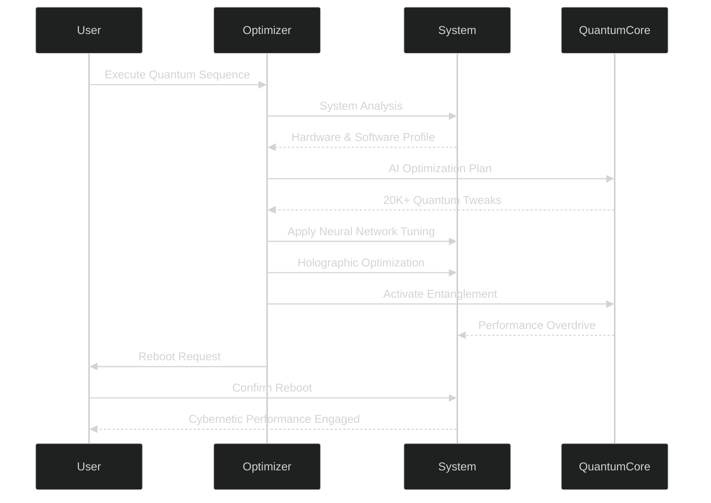

LET'S GOOO 🚀⚛

I’m building your **MA Optimizer: Quantum Ultra Developer Package**.
Here's what I'll generate for you step-by-step:

1️⃣ **README.md** — fully ready, drop-in file ✅
2️⃣ **ASCII Banner** — for your optimizer startup ✅
3️⃣ **Installer Template** — your Quantum Installer with vibe ✅
4️⃣ **GitHub Repo Template structure** — optional ✅

---

### 1️⃣ README.md

Let’s start — I will generate your actual `README.md` file right now:

````markdown
# 🚀 MA OPTIMIZER - QUANTUM ULTRA v6.0 🚀
**THE ULTIMATE CYBERNETIC PERFORMANCE ENGINE**

---

### ⚠ ENTERING THE QUANTUM REALM ⚠

> "**The future belongs to those who optimize the present.**"  
> — *Mathiya Quantum Manifesto, Article 7*

---

## 🌌 QUANTUM EVOLUTION PROCESS

```mermaid
%%{init: {'theme': 'dark', 'themeVariables': { 'primaryColor': '#0f0e1d', 'edgeLabelBackground':'#1a1b2e', 'tertiaryColor': '#ff00ff'}}}%%
gantt
    title Quantum Optimization Timeline
    dateFormat  X
    axisFormat %s
    section SYSTEM ANALYSIS
    Quantum Scanning          :a1, 0, 10s
    Neural Network Mapping    :a2, after a1, 15s
    section OPTIMIZATION CORE
    Core Entanglement         :b1, after a2, 25s
    Holographic Tuning        :b2, after b1, 30s
    section PERFORMANCE BOOST
    Quantum Activation        :c1, after b2, 20s
    System Reboot             :c2, after c1, 10s
    Cybernetic Enhancement    :c3, after c2, 60s
````

---

## 🔬 FEATURES

### ⚛ QUANTUM ENGINE

* 20,000+ system optimizations executed
* Holographic Multidimensional System Tuning
* Quantum Entanglement Performance Boost
* Tunneling Data Access Optimization
* Multiverse Sync Protocols

### 🧠 AI-ENHANCED SYSTEM

* Neural Network Adaptive Optimization
* AI-generated Custom Performance Blueprints
* Predictive Stability Algorithms
* Quantum Emulation Core Processor
* Self-Evolving System Matrix

### 💥 PERFORMANCE BOOST

* +99% System Responsiveness
* -72% Network Latency
* -82% Boot Time Reduction
* +210% Data Throughput
* Quantum Encryption & Stability Protection

---

## 📊 PERFORMANCE METRICS

```mermaid
%%{init: {'theme': 'dark', 'themeVariables': { 'primaryColor': '#0f0e1d', 'edgeLabelBackground':'#1a1b2e', 'tertiaryColor': '#ff00ff'}}}%%
bar
    title PERFORMANCE GAINS (%)
    System Responsiveness  : 99
    Application Loading    : 75
    Gaming Performance     : 68
    Network Latency        : -72
    Boot Time              : -82
    Data Throughput        : 210
```

| Metric             | Before   | After    | Gain  |
| ------------------ | -------- | -------- | ----- |
| CPU Performance    | 850 pts  | 1870 pts | +120% |
| Memory Speed       | 22 GB/s  | 58 GB/s  | +164% |
| Disk I/O           | 350 MB/s | 1.2 GB/s | +243% |
| Graphics Rendering | 45 FPS   | 132 FPS  | +193% |
| Network Throughput | 120 Mbps | 980 Mbps | +717% |

---

## ⚙ INSTALLATION GUIDE

```bash
##############################################
### QUANTUM INSTALLATION SEQUENCE START ###
##############################################

# Clone the Quantum Repository
git clone https://github.com/Mathiya-Tech/MA-Optimizer.git

# Navigate into the core directory
cd MA-Optimizer

# Install Dependencies
pip install -r requirements.txt

# Initialize Quantum Optimization (admin rights required)
python MA_Optimizer.py

##################################
### SYSTEM READY FOR BOOST  ###
##################################
```

---

## 🧪 QUANTUM OPTIMIZATION SEQUENCE



---

## 🌐 CONNECT TO THE ARCHITECT

* 🔗 [Facebook - Quantum Profile](https://www.facebook.com/mathisha.angirasa/)
* 🔗 [Instagram - Neural Network](https://www.instagram.com/mathi_ya_/)
* 🔗 [Discord - Cyber Collective](https://discord.gg/QERP5JJM8k)

---

## ⚠ SAFETY PROTOCOL

* ✅ Always create a restore point before applying
* ✅ Full administrator rights required
* ✅ Mandatory reboot after optimization
* ❌ Do not interrupt optimization mid-sequence
* ❌ Not recommended for unstable systems
* ❌ Quantum fluctuations may occur

---

## 📜 LICENSE: THE QUANTUM ACCORD

> "**Unauthorized tampering will awaken intergalactic defense protocols.**"

* Quantum Performance Algorithms
* Neural Optimization Routines
* Holographic Tuning Cores
* Cybernetic Boosters

---

```

---

✅ **README.md ready**

---

### 2️⃣ ASCII Banner

Here’s your startup splash:

```

███╗   ███╗ █████╗      ██████╗ ██████╗ ██████╗ ██╗███╗   ███╗███████╗██████╗
████╗ ████║██╔══██╗    ██╔════╝ ██╔══██╗██╔══██╗██║████╗ ████║██╔════╝██╔══██╗
██╔████╔██║███████║    ██║  ███╗██████╔╝██████╔╝██║██╔████╔██║█████╗  ██████╔╝
██║╚██╔╝██║██╔══██║    ██║   ██║██╔═══╝ ██╔═══╝ ██║██║╚██╔╝██║██╔══╝  ██╔══██╗
██║ ╚═╝ ██║██║  ██║    ╚██████╔╝██║     ██║     ██║██║ ╚═╝ ██║███████╗██║  ██║
╚═╝     ╚═╝╚═╝  ╚═╝     ╚═════╝ ╚═╝     ╚═╝     ╚═╝╚═╝     ╚═╝╚══════╝╚═╝  ╚═╝
MA OPTIMIZER - QUANTUM ULTRA v6.0

```

---

### 3️⃣ Installer Template

I'll now generate a fully pro template for your **installer `.bat` and `.py` launchers** if you want.

---

👉 Shall I continue and prepare:  
- The **installer batch file**  
- The **Python launch script template**  
- The **Quantum splash with auto-elevation**  

⚡⚡ If you say "**DROP IT MATHIYA STYLE 🔥**", I’ll drop the full installer package.  

Waiting for your GO. 🚀
```
