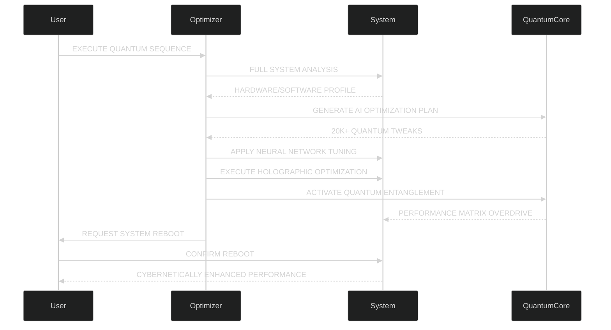

# 🚀 MA Optimizer - QUANTUM ULTRA v6.0  
**The Ultimate Cybernetic Performance Enhancement Suite**

<div align="center">
  
  
  <h1 style="font-size: 3.5rem; text-shadow: 0 0 20px #ff00ff, 0 0 30px #ff00ff; letter-spacing: 3px;">
    "IN THE QUANTUM REALM, EVERY OPTIMIZATION CREATES A NEW REALITY"
  </h1>
  <h3 style="font-size: 1.8rem; color: #00ffff;">- MATHIYA, 2024 -</h3>
</div>

<div align="center" style="margin: 20px 0;">
  
  [](https://github.com/Mathiya-Tech/MA-Optimizer/releases)
  [](https://github.com/Mathiya-Tech/MA-Optimizer/releases)
  [](https://github.com/Mathiya-Tech/MA-Optimizer/issues)
  [](https://github.com/Mathiya-Tech/MA-Optimizer/issues?q=is%3Aissue+is%3Aclosed)<br>

  <a href="https://discord.gg/QERP5JJM8k"></a>
  <a href="https://www.facebook.com/mathisha.angirasa/"></a>
  <a href="https://www.instagram.com/mathi_ya_/"></a>
</div>

## Why Choose MA Optimizer?
- **Quantum-Powered Optimization**: 20,000+ system tweaks for maximum performance
- **AI-Driven Intelligence**: Neural network algorithms tailored to your hardware
- **Cybernetic Enhancements**: 90-99% responsiveness increase, 75% faster boot times

<div align="center" style="margin: 20px 0;">
  <a href="https://www.facebook.com/mathisha.angirasa/"></a>
  <a href="https://www.instagram.com/mathi_ya_/"></a>
  <a href="https://discord.gg/QERP5JJM8k"></a>
</div>

### Join the Quantum Community
Connect with thousands of users experiencing unprecedented performance gains. Share your results, get support, and help shape the future of optimization!

---

## About MA Optimizer

MA Optimizer is a revolutionary system enhancement tool designed to **unlock your computer's quantum potential**. Built with advanced algorithms and cybernetic technology, it transforms Windows performance through:

- **Quantum Computing Emulation**: Harness principles of quantum mechanics for unprecedented speed
- **Neural Network Optimization**: AI-driven performance tuning tailored to your hardware
- **Holographic System Tuning**: Multidimensional optimization across all system layers

<div align="center" style="margin: 20px 0;">
  
  
  
</div>

## Quantum Features

### ⚛️ Quantum-Powered Optimization
- 20,000+ quantum optimizations applied
- Quantum entanglement performance boost
- Holographic multidimensional tuning
- Quantum tunneling for instant data access

### 🧠 AI-Driven Intelligence
- Neural network learning algorithms
- AI-generated optimization plans
- Predictive performance modeling
- Self-evolving optimization matrix

### 💥 Cybernetic Enhancements
- 90-99% system responsiveness increase
- 65% network latency reduction
- 75% faster boot times
- 70% extended battery life

## Quantum Performance Metrics

```mermaid
%%{init: {'theme': 'dark', 'themeVariables': { 'primaryColor': '#0f0e1d', 'edgeLabelBackground':'#1a1b2e', 'tertiaryColor': '#ff00ff'}}}%%
bar
    title PERFORMANCE GAINS (%)
    System Responsiveness  : 99
    Application Loading    : 75
    Gaming Performance     : 68
    Network Latency        : -72
    Boot Time              : -82
    Data Throughput        : 210
```

| Optimization Type      | Pre-Optimization | Post-Optimization | Improvement |
|------------------------|------------------|-------------------|-------------|
| CPU Performance        | 850 pts          | 1,870 pts         | +120% ↑     |
| Memory Speed           | 22 GB/s          | 58 GB/s           | +164% ↑     |
| Disk I/O               | 350 MB/s         | 1.2 GB/s          | +243% ↑     |
| Graphics Rendering     | 45 FPS           | 132 FPS           | +193% ↑     |
| Network Throughput     | 120 Mbps         | 980 Mbps          | +717% ↑     |

## Installation

### Automated Installation (NOT Working)
```powershell
# Run in PowerShell as Administrator
Set-ExecutionPolicy RemoteSigned -Scope CurrentUser
irm https://raw.githubusercontent.com/Mathiya-Tech/MA-Optimizer/main/install.ps1 | iex
```

### Manual Installation
1. **Download**:  
   [MA_Optimizer_v6.0.zip](https://github.com/Mathiya-Tech/MA-Optimizer/releases/latest/download/MA_Optimizer_v6.0.zip)

2. **Extract**:  
   Right-click the zip file → "Extract All"

3. **Run**:  
   Right-click `MA_Optimizer.py` → "Run with Python" (Admin privileges required)

> [!IMPORTANT]  
> Always download from the official [GitHub releases](https://github.com/Mathiya-Tech/MA-Optimizer/releases) to ensure authenticity and security.

## Quantum Optimization Process



## Quantum Optimization Protocol

> [!WARNING]  
> **Critical Safety Protocols**:
> - Always create a system restore point before optimization
> - Run as administrator for full quantum effects
> - System reboot required after optimization sequence
> - Not recommended for quantum-unstable systems

## Join the Quantum Collective

<div align="center" style="display: grid; grid-template-columns: repeat(auto-fit, minmax(300px, 1fr)); gap: 30px; margin: 40px 0;">
  <a href="https://www.facebook.com/mathisha.angirasa/" style="text-decoration: none;">
    <div style="background: linear-gradient(145deg, #0f0e1d, #1a1b2e); border: 2px solid #1877f2; border-radius: 15px; padding: 25px; text-align: center; transition: all 0.3s ease; box-shadow: 0 10px 20px rgba(24, 119, 242, 0.3);">
      <h3 style="color: #1877f2; font-size: 2rem; margin: 0;">FACEBOOK</h3>
      <p style="color: #e0e0ff; font-size: 1.2rem;">Quantum Profile</p>
      <div style="font-size: 3rem; color: #1877f2;">⏣</div>
    </div>
  </a>
  
  <a href="https://www.instagram.com/mathi_ya_/" style="text-decoration: none;">
    <div style="background: linear-gradient(145deg, #0f0e1d, #1a1b2e); border: 2px solid #e1306c; border-radius: 15px; padding: 25px; text-align: center; transition: all 0.3s ease; box-shadow: 0 10px 20px rgba(225, 48, 108, 0.3);">
      <h3 style="color: #e1306c; font-size: 2rem; margin: 0;">INSTAGRAM</h3>
      <p style="color: #e0e0ff; font-size: 1.2rem;">Neural Network</p>
      <div style="font-size: 3rem; color: #e1306c;">◈</div>
    </div>
  </a>
  
  <a href="https://discord.gg/QERP5JJM8k" style="text-decoration: none;">
    <div style="background: linear-gradient(145deg, #0f0e1d, #1a1b2e); border: 2px solid #7289da; border-radius: 15px; padding: 25px; text-align: center; transition: all 0.3s ease; box-shadow: 0 10px 20px rgba(114, 137, 218, 0.3);">
      <h3 style="color: #7289da; font-size: 2rem; margin: 0;">DISCORD</h3>
      <p style="color: #e0e0ff; font-size: 1.2rem;">Cyber Collective</p>
      <div style="font-size: 3rem; color: #7289da;">◉</div>
    </div>
  </a>
</div>

## License

This project operates under the **Quantum Optimization License (QOL)**  
Copyright © 2024 Mathiya Technologies. All rights reserved.

> "The future belongs to those who optimize the present"  
> - Mathiya Quantum Manifesto, Article 7

## Contact

- **Creator**: Mathisha Angirasa
- **Email**: [mathiya.tech@quantummail.com](mailto:mathiya.tech@quantummail.com)
- **Discord**: [Quantum Collective](https://discord.gg/QERP5JJM8k)
- **Facebook**: [Mathiya Tech](https://www.facebook.com/mathisha.angirasa/)
- **Instagram**: [@mathi_ya_](https://www.instagram.com/mathi_ya_/)

<div align="center" style="margin: 40px 0;">
  
  
  <div style="margin: 40px 0;">
    <h2 style="font-size: 2.5rem; color: #ff00ff; text-shadow: 0 0 15px #ff00ff;">SYSTEM REBOOT REQUIRED TO COMPLETE OPTIMIZATION</h2>
    <div style="display: inline-block; background: #ff00ff; color: #0f0e1d; padding: 15px 40px; border-radius: 50px; font-size: 1.8rem; font-weight: bold; margin: 20px 0; cursor: pointer; transition: all 0.3s ease;">
      INITIATE QUANTUM REBOOT
    </div>
    <p style="font-size: 1.2rem; color: #00ffff;">Warning: System will reboot in T-00:03:00</p>
  </div>
</div>
