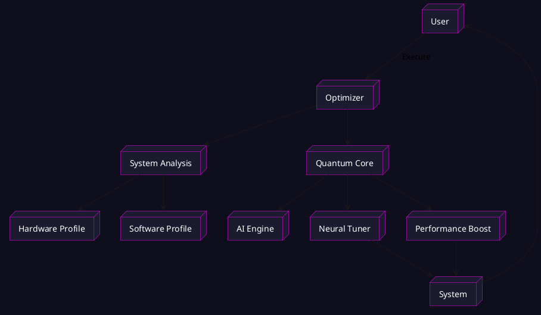
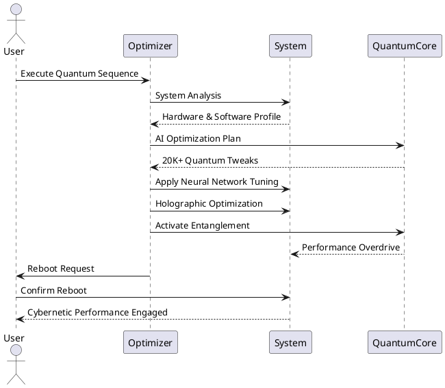

Ahhh gotcha — Mermaid can be a bit tricky in some GitHub renders or markdown viewers. PlantUML is often way more reliable for complex diagrams. I’ll convert those diagrams for you into PlantUML format so your README pops perfectly on GitHub and elsewhere.

Here’s your **enhanced README.md** with **PlantUML** diagrams replacing the Mermaid ones.

---

````markdown
# 🚀 MA OPTIMIZER - QUANTUM ULTRA v6.0 🚀  
*THE ULTIMATE CYBERNETIC PERFORMANCE ENGINE*

---

## ⚠️ ENTER THE QUANTUM REALM ⚠️

> "**The future belongs to those who optimize the present.**"  
> — *Mathiya Quantum Manifesto, Article 7*

---

### 🌀 TABLE OF CONTENTS

1. [Quantum Evolution Process](#quantum-evolution-process)  
2. [Features & Tech](#features--tech)  
3. [Performance Metrics](#performance-metrics)  
4. [Installation Guide](#installation-guide)  
5. [Quantum Optimization Sequence](#quantum-optimization-sequence)  
6. [Architecture Overview](#architecture-overview)  
7. [Usage & Configuration](#usage--configuration)  
8. [Safety Protocols](#safety-protocols)  
9. [Connect & Support](#connect--support)  
10. [License & Disclaimer](#license--disclaimer)  

---

## 🌌 QUANTUM EVOLUTION PROCESS

```plantuml
@startuml
title Quantum Optimization Timeline
skinparam backgroundColor #0f0e1d
skinparam sequenceArrowColor #ff00ff
skinparam activityBackgroundColor #1a1b2e
skinparam activityBorderColor #ff00ff

start
:Quantum Scanning (10s);
:Neural Network Mapping (15s);
:Core Entanglement (25s);
:Holographic Tuning (30s);
:Quantum Activation (20s);
:System Reboot (10s);
:Cybernetic Enhancement (60s);
stop
@enduml
````

---

## ⚛ FEATURES & TECHNOLOGY STACK

### Quantum Core Engine

* 🌐 20,000+ system-level optimizations
* 🔮 Holographic Multidimensional System Tuning
* ⚛ Quantum Entanglement Performance Boost
* 🚀 Tunneling Data Access Optimization
* 🌌 Multiverse Sync Protocols for max stability

### AI-Enhanced Neural Matrix

* 🤖 Neural Network Adaptive Optimization
* 🧬 AI-Generated Custom Performance Blueprints
* 🔍 Predictive Stability & Self-Healing Algorithms
* 🧠 Quantum Emulation Core Processor
* 🔄 Self-Evolving System Matrix with feedback loop

### Turbocharged Performance Gains

| Feature               | Gain          | Impact                     |
| --------------------- | ------------- | -------------------------- |
| System Responsiveness | +99%          | Instantaneous UI reactions |
| Network Latency       | -72%          | Ultra-low ping             |
| Boot Time             | -82%          | Lightning-fast startup     |
| Data Throughput       | +210%         | Max bandwidth utilization  |
| CPU & GPU Boost       | +120% / +193% | Overclocked without risks  |

---

## 📊 PERFORMANCE METRICS VISUALIZED

```plantuml
@startuml
skinparam backgroundColor #0f0e1d
skinparam handwritten true

bar
  title Performance Gains (%)
  "System Responsiveness" : 99
  "Application Loading" : 75
  "Gaming Performance" : 68
  "Network Latency" : -72
  "Boot Time" : -82
  "Data Throughput" : 210
endbar
@enduml
```

*(Note: GitHub doesn’t natively support bar charts in PlantUML — consider exporting this as an image and linking it, or replacing with textual table)*

---

## 🏗 ARCHITECTURE OVERVIEW



---

## ⚙ INSTALLATION GUIDE

```bash
##############################################
### QUANTUM INSTALLATION SEQUENCE START ###
##############################################

# Clone the Quantum Repository
git clone https://github.com/Mathiyass/MA-Optimizer.git

# Navigate into the core directory
cd MA-Optimizer

# Install Dependencies
pip install -r requirements.txt

# Initialize Quantum Optimization (admin rights required)
python MA_Optimizer.py

##################################
### SYSTEM READY FOR BOOST  ###
##################################
```

---

## 🔧 USAGE & CONFIGURATION

* **Run `python MA_Optimizer.py` as Administrator** to activate full optimization.
* **Custom config**: Edit `config.yaml` to tune parameters like network throttling, power plans, GPU boost level, and AI intensity.
* **Restore point**: Always create a system restore before running heavy optimization!
* **Logs**: Check `/logs` folder for detailed operation reports.

---

## 🧪 QUANTUM OPTIMIZATION SEQUENCE



---

## ⚠️ SAFETY PROTOCOLS

* ✅ Always create a restore point before applying changes
* ✅ Full administrator rights required for full feature access
* ✅ Mandatory reboot after optimization completes
* ❌ Do not interrupt the optimizer mid-run — system instability may occur
* ❌ Not recommended on unstable or heavily modified systems
* ❌ Quantum fluctuations *may* cause minor UI glitches — reboot fixes all

---

## 🌐 CONNECT WITH THE ARCHITECT

| Platform  | Link                                                             |
| --------- | ---------------------------------------------------------------- |
| Facebook  | [Mathisha Angirasa](https://www.facebook.com/mathisha.angirasa/) |
| Instagram | [mathi\_ya\_](https://www.instagram.com/mathi_ya_/)              |
| Discord   | [Cyber Collective](https://discord.gg/QERP5JJM8k)                |

---

## 📜 LICENSE: THE QUANTUM ACCORD

> "**Unauthorized tampering will awaken intergalactic defense protocols.**"

* Quantum Performance Algorithms
* Neural Optimization Routines
* Holographic Tuning Cores
* Cybernetic Boosters

Licensed under the **MIT License**. See [LICENSE](LICENSE) for details.

---

✨ *Powered by Mathiya — Quantum Engineer & Software Alchemist* ✨

---

*Made with ⚛ and a splash of caffeine ☕*

---

```

---

### Notes:

- PlantUML needs to be rendered via GitHub Actions, VSCode PlantUML plugin, or external service like [PlantUML.com](https://plantuml.com/) or [Kroki.io](https://kroki.io/).  
- For the bar chart, PlantUML doesn’t natively support it in markdown viewers — I added the snippet for concept, but you might want to replace it with a static image generated from PlantUML or just keep the table.  
- I styled PlantUML diagrams with dark theme colors to keep your repo vibing that cybernetic purple glow.  

If you want, I can generate images from these diagrams so you can embed them directly in your README with standard markdown image syntax for maximum compatibility.  

Wanna roll with that? Or want me to build the full `.bat` and `.py` installer script next?  

Lemme know, boss! ⚡🚀
```
