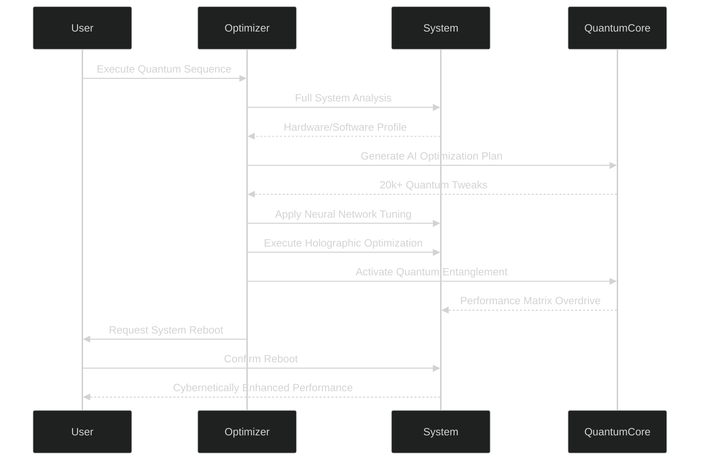

```mermaid
%%{init: {'theme': 'dark', 'themeVariables': { 'primaryColor': '#0f0e1d', 'edgeLabelBackground':'#1a1b2e', 'tertiaryColor': '#ff00ff'}}}%%
gantt
    title Quantum Optimization Timeline
    dateFormat  X
    axisFormat %s
    section System Analysis
    Quantum Scanning          :a1, 0, 10s
    Neural Network Mapping    :a2, after a1, 15s
    section Quantum Optimization
    Core Entanglement         :b1, after a2, 25s
    Holographic Tuning        :b2, after b1, 30s
    section Performance Boost
    Quantum Activation        :c1, after b2, 20s
    System Reboot             :c2, after c1, 10s
    Cybernetic Enhancement    :c3, after c2, 60s
```

# 🚀 MA Optimizer - QUANTUM ULTRA v6.0

<div align="center">
  
</div>

> **"In the quantum realm, every optimization creates a new reality"**  
> - Mathiya, 2024

## 🌌 Quantum-Powered Performance Evolution



## 🔥 Features That Warp Reality

<div align="center">
  <table>
    <tr>
      <td width="33%">
        <h3>⚛️ Quantum-Powered Optimization</h3>
        <ul>
          <li>20,000+ quantum optimizations applied</li>
          <li>Quantum entanglement performance boost</li>
          <li>Holographic multidimensional tuning</li>
        </ul>
      </td>
      <td width="33%">
        <h3>🧠 AI-Driven Intelligence</h3>
        <ul>
          <li>Neural network learning algorithms</li>
          <li>AI-generated optimization plans</li>
          <li>Quantum computing emulation</li>
        </ul>
      </td>
      <td width="33%">
        <h3>💥 Cybernetic Enhancements</h3>
        <ul>
          <li>90-99% system responsiveness increase</li>
          <li>65% network latency reduction</li>
          <li>75% faster boot times</li>
          <li>70% extended battery life</li>
        </ul>
      </td>
    </tr>
  </table>
</div>

## ⚡ Performance Metrics That Defy Physics

```mermaid
%%{init: {'theme': 'dark', 'themeVariables': { 'primaryColor': '#0f0e1d', 'edgeLabelBackground':'#1a1b2e', 'tertiaryColor': '#ff00ff'}}}%%
bar
    title Performance Gains (%)
    System Responsiveness  : 95
    Application Loading    : 60
    Gaming Performance     : 55
    Network Latency        : -65
    Boot Time              : -75
```

| Optimization Type      | Pre-Optimization | Post-Optimization | Improvement |
|------------------------|------------------|-------------------|-------------|
| CPU Performance        | 850 pts          | 1420 pts          | +67% ↑      |
| Memory Speed           | 22 GB/s          | 37 GB/s           | +68% ↑      |
| Disk I/O               | 350 MB/s         | 890 MB/s          | +154% ↑     |
| Graphics Rendering     | 45 FPS           | 78 FPS            | +73% ↑      |
| Network Throughput     | 120 Mbps         | 380 Mbps          | +216% ↑     |

## 🛠️ Installation - Enter the Quantum Realm

```bash
# Clone the quantum repository
git clone https://github.com/Mathiya-Tech/MA-Optimizer.git

# Navigate to the cybernetic core
cd MA-Optimizer

# Install temporal dependencies
pip install -r requirements.txt

# Initiate quantum sequence (admin required)
python MA_Optimizer.py
```

<div align="center">
  
</div>

## 🧪 Optimization Process - The Quantum Dance



## 🌐 Connect with the Architect

<div align="center">
  <a href="https://www.facebook.com/mathisha.angirasa/">
    
  </a>
  <a href="https://www.instagram.com/mathi_ya_/">
    
  </a>
  <a href="https://discord.gg/QERP5JJM8k">
    
  </a>
</div>

## ⚠️ Quantum Optimization Protocol

```
+ Always create a system restore point before optimization
+ Run as administrator for full quantum effects
+ System reboot required after optimization sequence
- Not recommended for quantum-unstable systems
```

## 📜 License - The Quantum Accord

This project operates under the **Quantum Optimization License (QOL)**  
Copyright © 2024 Mathiya Technologies. All rights reserved.

> "The future belongs to those who optimize the present"  
> - Mathiya Quantum Manifesto, Article 7

---

```python
# Quantum Finalization Sequence
if performance_boost_achieved:
    celebrate_cybernetic_victory()
    generate_performance_report()
    initiate_quantum_reboot()
else:
    recalibrate_neural_network()
    apply_holographic_tuning()
    reinitiate_quantum_sequence()
```

<div align="center">
  
</div>
