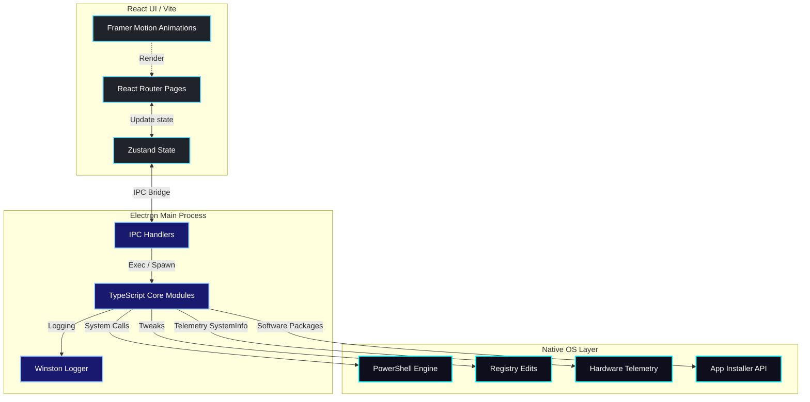

<div align="center">


<a href="https://github.com/Mathiyass/MA-Optimizer">
  
</a>

<br />

<div style="margin-top: 15px; margin-bottom: 25px; display: flex; justify-content: center; gap: 15px; flex-wrap: wrap;">
  <a href="https://github.com/Mathiyass/MA-Optimizer/releases"></a>
  <a href="https://github.com/Mathiyass/MA-Optimizer/releases"></a>
  <a href="https://github.com/Mathiyass/MA-Optimizer/stargazers"></a>
  <a href="https://github.com/Mathiyass/MA-Optimizer/issues"></a>
  <a href="https://github.com/Mathiyass/MA-Optimizer/blob/main/LICENSE"></a>
</div>

<div style="margin: 15px 0; display: flex; justify-content: center; gap: 8px; flex-wrap: wrap;">
  
  
  
  
  
  
</div>

</div>

<br>

<div align="center">
  <p align="center" style="font-size: 1.2em; font-weight: 300; line-height: 1.6; color: #a0aec0; max-width: 800px; margin: 0 auto;">
    <strong>MA Optimizer</strong> bridges the gap between raw system power and user accessibility. We wrapped hundreds of deep-level registry tweaks, PowerShell scripts, and system utilities into a beautiful, buttery-smooth glassmorphic interface. <br><br>
    <span style="color: #00ffff; font-weight: bold;">Unleash the true potential of your hardware with minimal effort.</span>
  </p>
</div>

<br>

---

## 📑 Quick Navigation

<table>
  <tr>
    <td align="center"><a href="#-key-features">✨ Key Features</a></td>
    <td align="center"><a href="#-visual-tour">📸 Visual Tour</a></td>
    <td align="center"><a href="#-getting-started">� Download & Install</a></td>
    <td align="center"><a href="#️-system-architecture">🏗️ Architecture</a></td>
    <td align="center"><a href="#-connect-with-us">💬 Community</a></td>
  </tr>
</table>

---

## ✨ Key Features

**MA Optimizer** is packed with 12+ meticulously engineered modules to bring out the absolute best in your Windows machine, whether you are an eSports gamer, power user, or casual consumer.

<table align="center" width="100%">
  <tr>
    <td width="50%" valign="top" style="padding: 20px;">
      <h3 style="color: #00ffff;">📊 Smart Dashboard</h3>
      <p>Monitor your PC's vital stats in real-time. View stunning telemetry charts covering CPU, RAM, Disk, and Network usage, all wrapped in a sleek, animated glassmorphism UI.</p>
    </td>
    <td width="50%" valign="top" style="padding: 20px;">
      <h3 style="color: #ff00ff;">⚡ Performance Tuning</h3>
      <p>Unleash maximum performance. Instantly apply one-click optimizations for CPU core parking, RAM management, process scheduling priorities, and Windows visual effects.</p>
    </td>
  </tr>
  <tr>
    <td width="50%" valign="top" style="padding: 20px;">
      <h3 style="color: #ffff00;">🎮 Gaming Pro Mode</h3>
      <p>Gain the competitive edge. Reduce input latency, block background distractions, apply optimal GPU settings, and activate dedicated eSports gaming presets for higher FPS.</p>
    </td>
    <td width="50%" valign="top" style="padding: 20px;">
      <h3 style="color: #00ffcc;">🛡️ Privacy Guard</h3>
      <p>Reclaim your data. Disable intrusive Windows telemetry, put a stop to tracking services, and lock down your personal information with uncompromising privacy controls.</p>
    </td>
  </tr>
  <tr>
    <td width="50%" valign="top" style="padding: 20px;">
      <h3 style="color: #ff5500;">🧹 Deep Cleaner</h3>
      <p>Free up precious disk space. Automatically purge gigabytes of temporary files, stale Windows Update caches, browser residuals, and system logs safely and quickly.</p>
    </td>
    <td width="50%" valign="top" style="padding: 20px;">
      <h3 style="color: #4287f5;">🛠️ System Repair</h3>
      <p>Fix common errors effortlessly. Automated integration of powerful native Windows tools like SFC, DISM, and Network resets to resolve complex system corruptions.</p>
    </td>
  </tr>
  <tr>
    <td width="50%" valign="top" style="padding: 20px;">
      <h3 style="color: #38B2AC;">📥 App Center & Installer</h3>
      <p>Set up a new PC in minutes. Browse and batch-install essential software directly from the app via lightning-fast Microsoft Winget integration.</p>
    </td>
    <td width="50%" valign="top" style="padding: 20px;">
      <h3 style="color: #ff2a2a;">🏎️ MA Power Plan</h3>
      <p>No more compromises. Install and activate our exclusive, community-tested custom power plan engineered specifically for sustained peak performance.</p>
    </td>
  </tr>
</table>

---

## 📸 Visual Tour

<div align="center">
  <p style="font-style: italic; color: #8892cc; max-width: 600px; margin-bottom: 30px;">
    Experience a modern interface designed for the next generation of Windows tools. Here's a glimpse into the beautiful design of MA Optimizer.
  </p>
</div>

<!-- TOP 3 IMAGES (HERO SHOWCASE) -->
<table border="0" style="border-collapse: collapse; width: 100%; border: none;">
  <tr>
    <td width="33%" align="center" style="border: none; padding: 10px;">
      
    </td>
    <td width="33%" align="center" style="border: none; padding: 10px;">
      
    </td>
    <td width="33%" align="center" style="border: none; padding: 10px;">
      
    </td>
  </tr>
</table>

<br>

<details>
<summary><b>🖼️ Click to Expand Full Visual Gallery (12 More Images)</b></summary>
<br>

<table border="0" style="border-collapse: collapse; width: 100%; border: none;">
  <tr>
    <td width="33%" align="center" style="border: none; padding: 8px;">
      
    </td>
    <td width="33%" align="center" style="border: none; padding: 8px;">
      
    </td>
    <td width="33%" align="center" style="border: none; padding: 8px;">
      
    </td>
  </tr>
  <tr>
    <td width="33%" align="center" style="border: none; padding: 8px;">
      
    </td>
    <td width="33%" align="center" style="border: none; padding: 8px;">
      
    </td>
    <td width="33%" align="center" style="border: none; padding: 8px;">
      
    </td>
  </tr>
  <tr>
    <td width="33%" align="center" style="border: none; padding: 8px;">
      
    </td>
    <td width="33%" align="center" style="border: none; padding: 8px;">
      
    </td>
    <td width="33%" align="center" style="border: none; padding: 8px;">
      
    </td>
  </tr>
  <tr>
    <td width="33%" align="center" style="border: none; padding: 8px;">
      
    </td>
    <td width="33%" align="center" style="border: none; padding: 8px;">
      
    </td>
    <td width="33%" align="center" style="border: none; padding: 8px;">
      
    </td>
  </tr>
</table>

</details>

---

## 🚀 Getting Started

### ⚡ Quick Install (Recommended)

<blockquote>
  The easiest way to get started. Open <b>PowerShell as Administrator</b> and paste the following to automatically download and install the latest release.
</blockquote>

```powershell
Set-ExecutionPolicy RemoteSigned -Scope CurrentUser -Force
irm "https://raw.githubusercontent.com/Mathiyass/MA-Optimizer/main/install.ps1" | iex
```

### 📦 Manual Install

If you prefer to install things manually:
1. Navigate to the [Releases](https://github.com/Mathiyass/MA-Optimizer/releases) page.
2. Download the latest `MA.Optimizer.Setup.exe`.
3. Run the installer (Administrator privileges are required for system tweaks to take effect).

---

## 🏗️ System Architecture

MA Optimizer utilizes a strict separation of concerns, ensuring an ultra-smooth React frontend while heavy system modifications are handled safely by the Electron backend via IPC (Inter-Process Communication).

<details>
<summary><b>⚙️ View Advanced Mermaid Architecture Diagram</b></summary>
<br>


```mermaid
graph TD
    classDef ui fill:#20232a,stroke:#61dafb,stroke-width:2px,color:#fff;
    classDef electron fill:#191970,stroke:#9cf,stroke-width:2px,color:#fff;
    classDef os fill:#0f0e1d,stroke:#00ffff,stroke-width:2px,color:#fff;
    
    subgraph Frontend [React UI / Vite]
        UI[React Router Pages]
        Z[Zustand State]
        F[Framer Motion Animations]
    end
    
    subgraph Main [Electron Main Process]
        IPC[IPC Handlers]
        TS[TypeScript Core Modules]
        L[Winston Logger]
    end
    
    subgraph Windows [Native OS Layer]
        PS[PowerShell Engine]
        Reg[Registry Edits]
        WMI[Hardware Telemetry]
        WinGet[App Installer API]
    end

    UI <-->|Update state| Z
    Z <-->|IPC Bridge| IPC
    F -.->|Render| UI
    
    IPC -->|Exec / Spawn| TS
    TS -->|Logging| L
    TS -->|System Calls| PS
    TS -->|Tweaks| Reg
    TS -->|Telemetry SystemInfo| WMI
    TS -->|Software Packages| WinGet
    
    class UI,Z,F ui;
    class IPC,TS,L electron;
    class PS,Reg,WMI,WinGet os;
```

</details>

---

## 👨‍💻 For Developers

Want to build or customize MA-Optimizer? The project is fully open-source and easy to set up.

### Prerequisites

- [Node.js](https://nodejs.org/) (v18+)
- [Git](https://git-scm.com/)
- A Windows Operating System *(Required for testing native API calls)*

### Setup Instructions

```bash
# 1. Clone the repository
git clone https://github.com/Mathiyass/MA-Optimizer.git

# 2. Enter the electron directory
cd MA-Optimizer/ma-optimizer-electron

# 3. Install dependencies
npm install

# 4. Launch Development mode (Vite + Electron concurrently)
npm run dev

# 5. Build standard installer for distribution
npm run dist:installer
```

---

## 🔒 Safety & Transparency

We believe in **"No Snake Oil"** optimization. Here's our promise to you:

- 🛡️ **100% Open Source:** Every script and registry change is fully inspectable in the `electron/ipc` directory.
- ✅ **Validated Tweaks:** Only officially documented Windows tuning mechanisms are used. No magic placebos.
- ♻️ **Safety First:** Built-in backup engines through standard Windows tools (System Restore Points).
- 🎮 **Ultimate Control:** You see everything we do and you can easily revert settings.

---

## 💬 Connect with Us

Have suggestions, want to contribute, or need support? We would love to hear from you!

<div align="center" style="margin: 30px 0;">
  
  <a href="https://discord.gg/QERP5JJM8k">
    
  </a>
  <a href="https://www.instagram.com/mathi_ya_/">
    
  </a>
  <a href="https://www.facebook.com/mathisha.angirasa/">
    
  </a>

</div>

---

<div align="center">
  
  <br />
  <p>Copyright © 2024 Mathiya. Licensed under the <a href="LICENSE" style="color: #00ffff; font-weight: bold;">MIT License</a>.</p>
  <p>
    
    
    
  </p>
</div>
