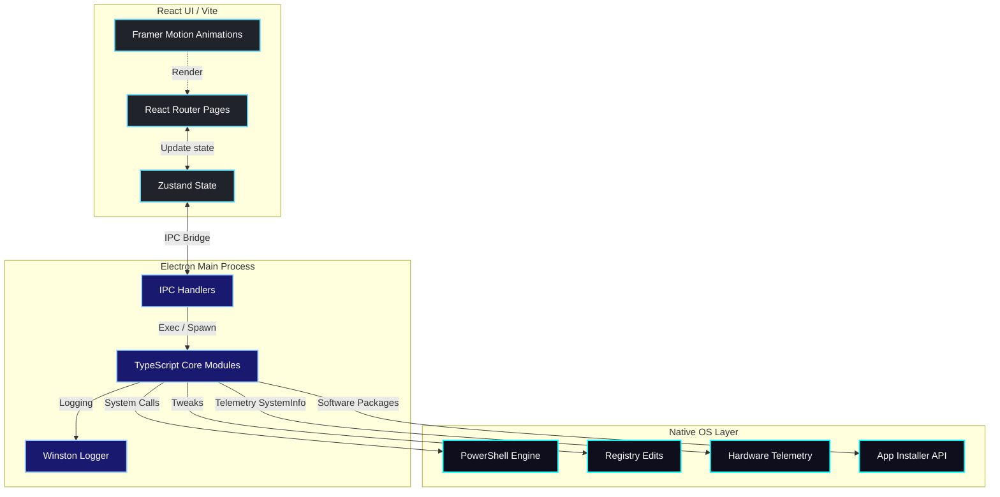

<div align="center">


<a href="https://github.com/Mathiyass/MA-Optimizer">
  
</a>

<br />

<div style="margin-top: 15px; margin-bottom: 25px; display: flex; justify-content: center; gap: 10px; flex-wrap: wrap;">
  <a href="https://github.com/Mathiyass/MA-Optimizer/releases"></a>
  <a href="https://github.com/Mathiyass/MA-Optimizer/releases"></a>
  <a href="https://github.com/Mathiyass/MA-Optimizer/stargazers"></a>
  <a href="https://github.com/Mathiyass/MA-Optimizer/issues"></a>
  <a href="https://github.com/Mathiyass/MA-Optimizer/blob/main/LICENSE"></a>
</div>

<div style="margin: 15px 0;">
  
  
  
  
  
  
</div>

</div>

---

<div align="center">
  <h2>🌌 Seamless Design. Unlimited Power.</h2>
  <p>
    <strong>MA Optimizer</strong> bridges the gap between raw system power and user accessibility, wrapping hundreds of deep-level registry tweaks, PowerShell scripts, and system utilities into a beautiful, buttery-smooth glassmorphic interface powered by Framer Motion.
  </p>
</div>

---

## 📑 Table of Contents

- [✨ Key Features](#-key-features)
- [📸 Visual Tour](#-visual-tour)
- [🏗️ System Architecture](#️-system-architecture)
- [🚀 Getting Started](#-getting-started)
- [👨‍💻 For Developers](#-for-developers)
- [🔒 Safety & Transparency](#-safety--transparency)
- [💬 Connect with Us](#-connect-with-us)

---

## ✨ Key Features

MA Optimizer consists of 12+ meticulously engineered modules to bring out the absolute best in your Windows machine.

<table>
  <tr>
    <td width="50%">
      <h3>📊 Smart Dashboard</h3>
      <p>Real-time monitoring of CPU, RAM, Disk, and Network with beautiful telemetry charts via Recharts and fluid page transitions.</p>
    </td>
    <td width="50%">
      <h3>⚡ Performance Tuning</h3>
      <p>One-click optimizations for CPU parking, RAM management, process priorities, and visual effects.</p>
    </td>
  </tr>
  <tr>
    <td width="50%">
      <h3>🎮 Gaming Pro</h3>
      <p>Reduce input latency, disable background distractions, optimize GPU settings, and activate dedicated gaming presets.</p>
    </td>
    <td width="50%">
      <h3>🛡️ Privacy Guard</h3>
      <p>Control intrusive Windows telemetry, disable tracking services, and lock down your personal data with a click.</p>
    </td>
  </tr>
  <tr>
    <td width="50%">
      <h3>🧹 Deep Cleaner</h3>
      <p>Reclaim gigabytes of space by purging temporary files, stale Windows update caches, and log residuals.</p>
    </td>
    <td width="50%">
      <h3>🛠️ System Repair</h3>
      <p>Automated integration of native Windows SFC, DISM, and Network repair tools to fix common and complex corruptions.</p>
    </td>
  </tr>
  <tr>
    <td width="50%">
      <h3>📥 App Center & Installer</h3>
      <p>Batch install essential software directly from the interface via high-speed Winget integration.</p>
    </td>
    <td width="50%">
      <h3>🏎️ MA Power Plan</h3>
      <p>Install and activate an exclusive, community-tested custom power plan engineered for peak performance.</p>
    </td>
  </tr>
</table>

---

## 📸 Visual Tour

<div align="center">
  <p><em>Experience a modern interface designed for the next generation of Windows tools.</em></p>
  
  
  
  <p float="left">
    
    
  </p>
  
  <sub>*(If you haven't uploaded images to `public/` yet, placeholder images will be shown above!)*</sub>
</div>

---

## 🏗️ System Architecture

MA Optimizer utilizes a strict separation of concerns, ensuring an ultra-smooth React frontend while heavy system modifications are handled safely by the Electron backend.


```mermaid
graph TD
    classDef ui fill:#20232a,stroke:#61dafb,stroke-width:2px,color:#fff;
    classDef electron fill:#191970,stroke:#9cf,stroke-width:2px,color:#fff;
    classDef os fill:#0f0e1d,stroke:#00ffff,stroke-width:2px,color:#fff;
    
    subgraph Frontend [React UI / Vite]
        UI[React Router Pages]
        Z[Zustand State]
        F[Framer Motion Animations]
    end
    
    subgraph Main [Electron Main Process]
        IPC[IPC Handlers]
        TS[TypeScript Core Modules]
        L[Winston Logger]
    end
    
    subgraph Windows [Native OS Layer]
        PS[PowerShell Engine]
        Reg[Registry Edits]
        WMI[Hardware Telemetry]
        WinGet[App Installer API]
    end

    UI <-->|Update state| Z
    Z <-->|IPC Bridge| IPC
    F -.->|Render| UI
    
    IPC -->|Exec / Spawn| TS
    TS -->|Logging| L
    TS -->|System Calls| PS
    TS -->|Tweaks| Reg
    TS -->|Telemetry SystemInfo| WMI
    TS -->|Software Packages| WinGet
    
    class UI,Z,F ui;
    class IPC,TS,L electron;
    class PS,Reg,WMI,WinGet os;
```

---

## 🚀 Getting Started

### ⚡ Quick Install (Recommended)

Open **PowerShell as Administrator** and paste the following to automatically download and install the latest release:

```powershell
Set-ExecutionPolicy RemoteSigned -Scope CurrentUser -Force
irm "https://raw.githubusercontent.com/Mathiyass/MA-Optimizer/main/install.ps1" | iex
```

### 📦 Manual Install

1. Navigate to the [Releases](https://github.com/Mathiyass/MA-Optimizer/releases) page.
2. Download the latest `MA.Optimizer.Setup.exe`.
3. Run the installer (Administrator privileges are required for system tweaks to take effect).

---

## 👨‍💻 For Developers

Want to build or customize MA-Optimizer? The project is fully open-source and easy to set up.

### Prerequisites

- [Node.js](https://nodejs.org/) (v18+)
- [Git](https://git-scm.com/)
- A Windows Operating System (Required for testing native API calls)

### Setup Instructions

```bash
# 1. Clone the repository
git clone https://github.com/Mathiyass/MA-Optimizer.git

# 2. Enter the electron directory
cd MA-Optimizer/ma-optimizer-electron

# 3. Install dependencies
npm install

# 4. Launch Development mode (Vite + Electron concurrently)
npm run dev

# 5. Build standard installer for distribution
npm run dist:installer
```

---

## 🔒 Safety & Transparency

We believe in **"No Snake Oil"** optimization. Here's our promise:

- **100% Open Source:** Every script and registry change is fully inspectable in the `electron/ipc` directory.
- **Validated Tweaks:** Only officially documented Windows tuning mechanisms are used.
- **Safety First:** Built-in backup engines through standard Windows tools.

---

## 💬 Connect with Us

Have suggestions or need support? Connect with the growing community!

- [**Discord Community**](https://discord.gg/QERP5JJM8k) — Chat with other optimizers and get real-time help.
- [**Instagram**](https://www.instagram.com/mathi_ya_/) — Follow for sneak peaks and progress updates.
- [**Facebook**](https://www.facebook.com/mathisha.angirasa/) — Join the official community page.

---

<div align="center">
  
  <br />
  <p>Copyright © 2024 Mathiya. Licensed under the <a href="LICENSE" style="color: #00ffff; font-weight: bold;">MIT License</a>.</p>
  <p>
    
    
    
  </p>
</div>
